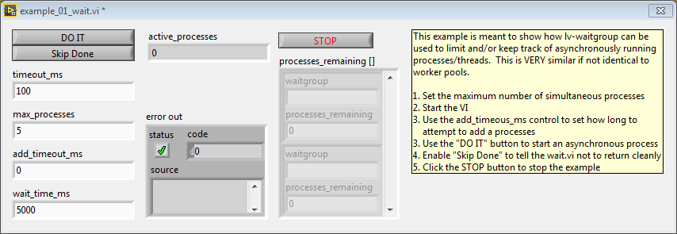
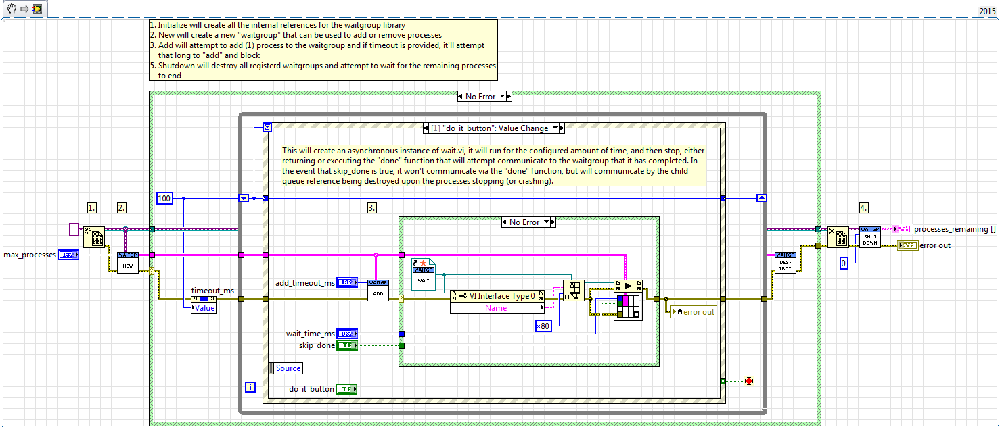
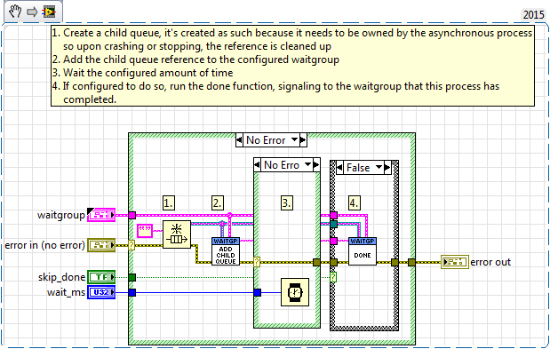

# lv-waitgroup

lv-waitgroup is a LabVIEW library that provides the ability to track and limit a group of asynchronous processes. lv-waitgroup is built off of the ideas from Go's Waitgroup in the Sync library (https://golang.org/pkg/sync/).

## Use Cases

Lettuce be cereal, there's only a couple of really specific use cases in LabVIEW where you want to monitor asynchronous processes, generally you'll use chunking in a For loop or the process lasts for so little time its okay if you maybe rail out the processor every once in a while.  So this is specifically for __complex__ loops that either use an appreciable amount of cpu/memory where not limiting the number of processes can be a big deal OR (similarly) an environment where your resources are fixed (like a LinuxRT) and you want to limit jitter/calls to the memory manager etc.

Otherwise it's uselesss, don't use this.

Following my expected normal use case, you'll use the new function with an instantiated varaint DVR, create a waitgroup and then pass that waitgroup to your async functions/mains. When those functions crash or are completed, the done function (or the child queue) will signal to the waitgroup that it's done and allow new processes to be added.

example_01_wait.vi




wait.vi



## Folder structure:

```
+-- distribution
|   +-- vipm
|   |   +-- lv-waitgroup.vipb
|   +-- working
+-- source
|   +-- lv-waitgroup.lvproj
|   +-- lv-waitgroup.lvlps
|   +-- lv-waitgroup
|   |   +-- examples
|   |   |   +-- _subvis
|   |   |   |   +-- wait.vi
|   |   |   +-- example_01_wait.vi
|   |   +-- private
|   |   |   +-- _controls
|   |   |   |   +-- waitgroup.ctl
|   |   |   +-- _subvis
|   |   |   |   +-- generate_id.vi
|   |   +-- public
|   |   |   +-- _controls
|   |   |   |   +-- api_child_queue.ctl
|   |   |   |   +-- api_waitgroup.ctl
|   |   |   |   +-- data_error.ctl
|   |   |   +-- _subvis
|   |   |   |   +-- utilities
|   |   |   |   |   +-- util_generate_error.vi
|   |   |   |   +-- add_child_queue.vi
|   |   |   |   +-- add.vi
|   |   |   |   +-- destroy.vi
|   |   |   |   +-- done.vi
|   |   |   |   +-- new.vi
|   |   |   |   +-- status.vi
|   |   |   +-- shutdown.vi
+-- .gitignore
```
## Motiviations behind architecture

If you look at the first couple of commits you can see me trying different ideas for the architecture of the project, i went from an asynchronous functional global solution that broke data flow to a synchronous "by value" solution that just passed around a variant DVR and breaks data flow, but in a way that's a little more obvious.

Although there's an obvious blocking nature between most functions, the timeouts can be set to 0 to minimize and if you want waitgroups to be able to work simultaneously without blocking each other, you can use different DVRs which I prefer in light of some super complex semaphore/mutex solution to safely lock between waitgroups.

## VI Descriptions

These are copy+pasta'd from the VIs themselves.

add.vi can be used to synchronously "add" a process to a waitgroup, in a trade-off for simplicity, the DVR will block any other simultaneous attempts to add (for the same DVR). Using a timeout_ms of 0 will allow you to add as fast as possible, while a timeout of -1 is prevented because it would cause a deadlock (processes can't done.vi if the DVR is currently locked). Any output error will indicate a failed "add".

done.vi signals to the waitgroup that the process is "done", it does so by closing the child queue, removing it from the queues variant and dequeing from the waitgroup queue.

status.vi will take a given Waitgroup reference, pull the waitgroup ID and get the number of active processes.

new.vi when provided with a valid variant DVR and a set number of max_processes, it will create an ID and generate a "Waitgroup" reference, which combines the provided DVR reference with the ID for the waitgroup that can be used for a number of downstream/child functions.  This waitgroup reference can be used to group processes under the same waitgroup. Use new.vi every time you want to group processes.

destroy.vi will take a provided waitgroup and wait_ms to wait for each remaining process to complete, the child process queues will block for the given value of wait_ms; it's value will be validated to be zero or more. This function "Closes" a given waitgroup and it won't exist anymore within the DVR, even if you re-use the reference. 

add_child_queue can be used to provide a queue reference (of type string) that's stored as a way to know if a process has died/crashed unexpectedly.  In the event that there's a child queue, and the vi that created it crashes/dies, the queue becomes invalid and any calling processes in the Waitgroup can then automatically "Done" the process because the queue reference is invalid.

shutdown.vi is meant to be used with the ouput of the Delete Data Value Reference function. It will "Close" all of the waitgroups within the DVR, but without the protection of the threadsafe DVR. It also contains a wait input that will wait for processes to complete. Upon completion, it will provide you with the number of processes remaining for each waitgroup.


